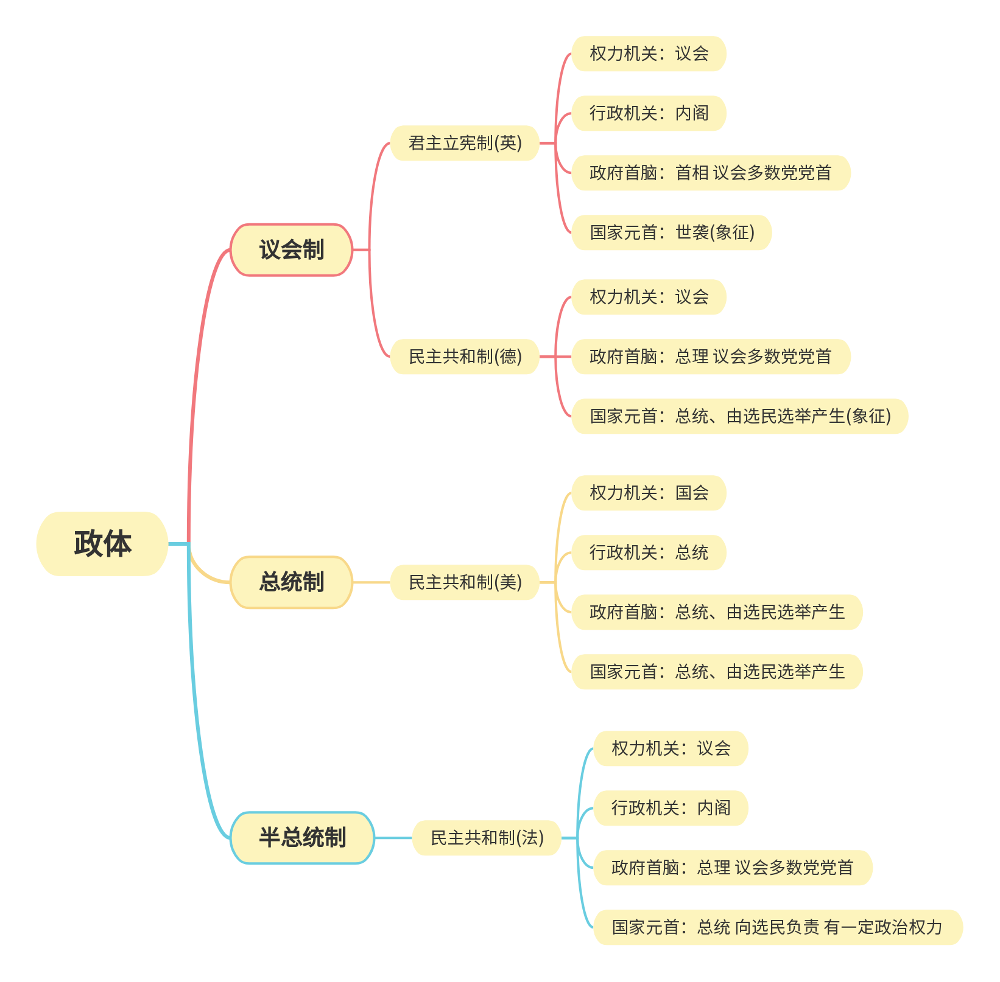

# 选必一 当代国际政治与经济

> [!warning]
> 本页面尚未编辑完成

## 第一课 国体与政体

### 国家
- 国家是一种历史现象，不是从来就有的。国家是在原始社会瓦解、私有制出现、阶级形成以后产生的，是阶级矛盾不可调和的产物和表现。
- 基本要素：人口、领土、政权和**主权(最重要的)**
    - 主权：主权是国家的生命和灵魂，是国家统一而不可分割的最高权力。对内至高无上，对外独立自主。
    - 领土：领路+领水(12海里)+领空
- 国家的性质，就是国家的阶级本质。统治阶级的性质决定着国家的性质
- 本质：所有国家都是一定阶级对其他阶级的专政
    - 专政：统治阶级统治其他阶级。
    - 民主：统治阶级范围内按照多数人的意志实现职能。民主具有阶级性。
    - 民主与专政相互依存。民主是专政的基础，专政是民主的保障。
> [!tip]
> 专制(独裁)：多数人服从少数人

- 职能：政治统治和社会管理。政治统治工具(国家强制力)：军队、警察、法庭、监狱等
- 国家性质 决定 国家职能。国家职能 体现和反映 国家性质
- 社会主义与资本主义
    - 异：民主主体、专政对象、民主特点、民主本质
    - 同：民主与专政的统一、阶级性质
    - 社会主义国家不同于一切剥削阶级国家；本质上，社会主义民主优于资本主义民主。
    - 新型的民主与新型的专政，体现着社会主义国家的本质特征。

### 国体与政体
- 国体，即国家性质，反映社会各阶级在国家中的地位(权利归属)
- 政体，即国家政权的组织形式，也就是国家管理形式(权力的分配)
- 国体与政体的关系
    - 国体决定政体，政体体现国体，一定的政体服务于一定的国体
    - 国体与政体同属于国家制度，即内容与形式两个方面。
    - 相对独立。纵向看，一个国家的政体会变化。横向看，各个国家的政体都不同。
- 代议制：由选举产生的、代表民意的机关来行使国家权力的制度
    - 原因：公民广泛参与才是民主；不可能全体公民都经常性地直接管理所有国家事务
    - 意义：代议制是公民与国家之间的政治纽带，这是现代民主政体的共同特征。代议制本质上是一种间接民主。

### 现代政体(立法机关)
- 人民代表大会制度
    - 地位：人民代表大会制度是我国的根本政治制度
    - 必然性：党和人民的伟大创造。人民的选择、历史的必然。
    - 作用：决定着国家的其他具体制度。是当家做主的重要途径和最高实现形式，是中国社会主义政治文明的重要制度载体
    - 意义：是符合中国国情和实际、体现社会主义国家性质、保证人民当家做主、保障实现中华民族伟大复兴的好制度
- 从**国家政权机关和国家元首的产生方式及其职权范围**看，现代资本主义国家主要分为民主共和制和君主立宪制。
- 民主共和制
    - 产生：国家权力机关和国家元首一般经由选举产生
    - 弊端：对内，资产阶级以民主形式掩盖国家的阶级性质。对外，一些发展中国家照搬他国模式，但这种模式不符合国情，既不能保障人民权利，也难以保障国家政权形式。
- 君主立宪制
    - 产生：国家元首由世袭的君主担任，但在宪法框架内，君主的权力受到不同程度的限制。
    - 在英日西泰和瑞典等国家，国家政权的实际运行与民主共和制国家大体相同。

### 现代政体(行政机关)
- 从**立法机关与行政机关**的关系看，现代资本主义国家主要分为议会制、总统制、半总统制。
- 议会制(内阁制、议会内阁制、责任内阁制)
    1. 政府总览国家的行政权力，向议会负责。
    2. 政府以议会为基础产生，接受议会监督，定期向议会报告工作。
    3. 政府首脑由多数党(联盟)领袖担任。
    4. 政府首脑从议员中挑选一些作为阁员，提请国家元首任命。
    5. 当议会对政府表示不信任时，政府必须集体辞职，由国家元首指定人员重新组织政府；或由政府首脑提请国家元首解散议会，重新进行议会选举并成立新的政府。
    - 典型国家：英日德意、西班牙、波兰、芬兰、奥地利、新西兰、印度和新加坡等
    - 上台关键：议会选举
- 总统制
    1. 总统既是国家元首，也是政府首脑。总统不仅是国家的象征和代表，而且直接行使国家最高行政权力。总统是权力中心。
    2. 总统独立于议会之外，由选民直接选举或间接选举产生，一般有任期限制。
    3. 总统只对选民负责，不对议会负责，但在某些重大事务上可能会受到议会的制约。
    - 典型国家：美韩、墨西哥、巴西、阿根廷、埃及和印度尼西亚等
    - 上台关键：总统大选
- 半总统制
    1. 既选举总统作为国家元首，行使一定行政权力，又推举政府首脑，向议会负责。
    - 典型国家：法国、乌克兰和黎巴嫩等
> [!tip]
> 政府首脑：政府首相、内阁总理或总统同时担任；国家元首：主席、总统或君主

### 政党
- 马克思主义政党观
    1. 产生：政党是在阶级的基础上产生的，是阶级斗争发展到一定阶段的产物。
    2. 地位：政党是阶级的领导者
    3. 性质：政党是有组织的政治团体
    4. 主要目标：执政(巩固统治)或积极致力于推广某种政治思想、维护某种政治利益
    5. 主要手段：代议制下，主要手段是参加选举
    6. 政治纲领：政党通常有特定的政治目标和意识形态，对国家大政方针和社会议题有明确的态度和主张，这些往往体现在其政纲或党章中
    7. 本质(定义)：阶级性是政党的本质属性。特定阶级利益的集中者。
    > [!info]
    > 一党制：只有1个合法政党。我国政党制度不是一党制，而是中国共产党领导的多党合作和政治协商制度。
- 常见的政党制度
    - 一党制：越南、朝鲜
    - 两党制：英美
    - 多党制：日法德意
    - 根本性质：维护资产阶级利益、欺骗人民大众
- 中国政党制度
    - 中国共产党领导的多党合作和政治协商制度
    - 特点(根本性质)：是中国共产党、中国人民和各民主党派、无党派人士的伟大政治创造，是从中国土壤中生长出来的新型政党制度

### 利益集团
- 含义：利益集团是指具有共同利益，向政府或社会提出诉求，或以合法手段施加压力，介意影响公共政策，以争取其团体利益及其成员利益的社会团体。又称压力团体或倡议团体
- 地位：现代政治体系的重要组成部分
- 特点：不利益集团不同于政党，它们不以取得政权或改变政权为目标，而是在既有政治体制内进行完全合法的活动
- 影响途径：游说、宣传、助选、集会游行、司法诉讼等
- 分类：自利型(商会、医协、教协)和公益型(环保组织、妇联等)
- 作用：资本主义国家的利益集团，虽然在一定程度上会起到缓和社会矛盾的作用，但无法从根本上解决不同阶级之间的矛盾
